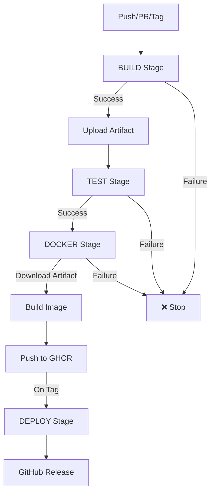

# Container Pilot CI/CD - Quick Reference

## 🚀 GitHub Actions Pipeline

### Single Unified Workflow
```
.github/workflows/ci-cd.yml
```

**Nu mai multe workflow-uri!** Tot într-un singur fișier, stage-uri secvențiale.

## 📋 Pipeline Stages

```
BUILD → TEST → DOCKER → DEPLOY
  ⬇️      ⬇️      ⬇️       ⬇️
 artifact reuse   push    release
```

## 🔄 Triggers

| Event | Action |
|-------|--------|
| Push `main` | Build + Test + Docker (`latest`) |
| Push `develop` | Build + Test + Docker (`develop`) |
| PR | Build + Test only |
| Tag `v*` | Full pipeline + Deploy |
| Manual | Workflow dispatch |

## 📦 Artifacts

Build artifact-ul este **refolosit** în toate stage-urile:
- Creat în: **BUILD** stage
- Folosit în: **DOCKER** stage
- Nu se rebuild! Efficiency++

## 🐳 Docker Images

### Registry
```bash
ghcr.io/<username>/container-pilot
```

### Tags Strategy
- `latest` - main branch
- `develop` - develop branch  
- `v1.2.3` - semantic version tags
- `main-abc123` - commit SHA
- `pr-42` - pull requests

### Multi-platform
- `linux/amd64` (Intel/AMD)
- `linux/arm64` (ARM, Apple Silicon)

## 🔧 Local Testing

Replică exact CI/CD-ul:

```bash
# Build backend
cd src/ContainerPilot.Server
dotnet restore
dotnet build -c Release
dotnet publish -c Release -o ./bin/Release/net8.0/publish

# Build frontend
cd src/ContainerPilot.Server.Client
npm ci
npm run build

# Combine
mkdir -p ../bin/Release/net8.0/publish/wwwroot
cp -r dist/* ../bin/Release/net8.0/publish/wwwroot/

# Prepare for Docker
cd ../../../../
rm -rf publish
cp -r src/ContainerPilot.Server/bin/Release/net8.0/publish ./publish

# Build image (same as CI/CD)
docker build -t container-pilot:local -f Dockerfile.podman .

# Test
docker run -p 5000:5000 -v /var/run/docker.sock:/var/run/docker.sock container-pilot:local
```

## 🎯 Release Process

```bash
# 1. Update version
# Edit: src/ContainerPilot.Server/ContainerPilot.Server.csproj
# <Version>1.2.3</Version>

# 2. Commit
git add .
git commit -m "chore: release v1.2.3"

# 3. Tag
git tag -a v1.2.3 -m "Release v1.2.3"

# 4. Push (triggers full pipeline)
git push origin main --tags
```

## 🔐 Permissions

**Zero custom secrets needed!**

Pipeline folosește:
- `GITHUB_TOKEN` - automat generat
- `github.actor` - username automat
- Permissions: `contents:read`, `packages:write`

## 🐛 Troubleshooting

### Build fails
```bash
# Check logs
dotnet build -c Release --verbosity detailed
npm ci --loglevel verbose
```

### Docker fails
```bash
# Local test
docker build -t test -f Dockerfile.podman .
docker run -p 5000:5000 test
```

### Image too large
Check:
1. `.dockerignore` configured?
2. Using multi-stage? ✅
3. Base image size? (aspnet:8.0.20-jammy ✅)

## 📊 Monitoring

### Status Badge
```markdown
[](https://github.com/<user>/container-pilot/actions)
```

### View Pipeline
```
GitHub → Actions → CI/CD Pipeline → Latest run
```

## ⚡ Optimization

### Cache Strategy
- **npm**: Dependencies cached by setup-node
- **NuGet**: Packages cached by setup-dotnet
- **Docker**: Layer cache via GitHub Actions cache

### Build Time
- First run: ~5-8 min
- Cached run: ~2-4 min
- Hot cache: ~1-2 min

### Artifact Retention
- **1 day** - sufficient pentru pipeline reuse
- Reduces storage costs

## 🔄 Workflow Diagram



## 📝 Notes

- **Sequential stages**: Nu paralel, uno după altul
- **Single workflow**: Un singur `ci-cd.yml`
- **Artifact reuse**: Build once, use everywhere
- **Grouped execution**: Tot într-un single run
- **Clear visualization**: GitHub Actions UI arată toate stage-urile

## 🆘 Support

- Logs: GitHub Actions UI
- Issues: GitHub Issues
- Docs: `.github/CICD.md`
