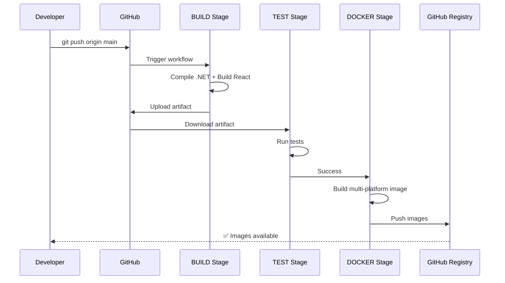

# Container Pilot - CI/CD Complete Summary

## ✅ Ce am implementat

### 1. Single Unified Pipeline ✨
```
.github/workflows/ci-cd.yml
```

**Un singur workflow** cu stage-uri **secvențiale**:
1. **BUILD** - Backend (.NET) + Frontend (React)
2. **TEST** - Unit tests + Code quality
3. **DOCKER** - Build & push multi-platform images
4. **DEPLOY** - GitHub releases (doar pe tags)

### 2. Artifact Reuse Strategy 🔄

```
BUILD Stage
    ↓
Creates artifact: published-app/
    ↓
DOCKER Stage (reuses artifact)
    ↓
No rebuild! Efficiency++
```

**Benefit**: Build o dată, folosește peste tot!

### 3. Multi-Platform Docker Images 🐳

Imagini pentru:
- `linux/amd64` (Intel/AMD x86_64)
- `linux/arm64` (ARM, Apple Silicon, Raspberry Pi)

### 4. Smart Tagging Strategy 🏷️

| Event | Tags Generated |
|-------|---------------|
| Push `main` | `latest`, `main-<sha>` |
| Push `develop` | `develop`, `develop-<sha>` |
| Tag `v1.2.3` | `v1.2.3`, `1.2`, `1`, `latest` |
| Pull Request | `pr-<number>` |

### 5. Cgroupv2 Fix pentru Podman 🔧

**Problema**: `memory swappiness with cgroupv2: OCI runtime error`

**Soluția**: În `DockerService.cs`, când recreăm container la UPDATE, creăm un nou `HostConfig` fără setări incompatibile cu cgroupv2:

```csharp
var newHostConfig = new HostConfig
{
    Binds = containerInfo.HostConfig.Binds,
    NetworkMode = containerInfo.HostConfig.NetworkMode,
    PortBindings = containerInfo.HostConfig.PortBindings,
    // Exclude MemorySwappiness pentru Podman compatibility
};
```

## 📁 Structura CI/CD

```
.github/
├── workflows/
│   └── ci-cd.yml          # Single unified pipeline
├── CICD.md                # Complete documentation
└── CICD-QUICK.md          # Quick reference

Dockerfile.podman           # Production Dockerfile (CI/CD compatible)
.dockerignore              # Optimized build context
```

## 🔄 Workflow Execution

### On Push (main/develop)



### On Tag (v1.2.3)

Toate stage-urile de mai sus **PLUS**:
- **DEPLOY** stage
- GitHub Release creation
- Release notes auto-generate

## 🎯 Local Development = CI/CD Replica

Același workflow poate fi replicat local:

```powershell
# 1. Build backend
cd src/ContainerPilot.Server
dotnet restore
dotnet build -c Release
dotnet publish -c Release -o ./bin/Release/net8.0/publish

# 2. Build frontend
cd src/ContainerPilot.Server.Client
npm ci
npm run build

# 3. Combine
New-Item -Path "../bin/Release/net8.0/publish/wwwroot" -ItemType Directory -Force
Copy-Item -Path "dist/*" -Destination "../bin/Release/net8.0/publish/wwwroot/" -Recurse -Force

# 4. Prepare Docker context
cd ../../../../
Remove-Item -Path "publish" -Recurse -Force -ErrorAction SilentlyContinue
Copy-Item -Path "src/ContainerPilot.Server/bin/Release/net8.0/publish" -Destination "publish" -Recurse -Force

# 5. Build image (EXACT ca în CI/CD)
podman build -t container-pilot:local -f Dockerfile.podman .

# 6. Test
podman run -d -p 5000:5000 -v /run/podman/podman.sock:/var/run/docker.sock:rw container-pilot:local
```

## 🚀 Release Process

```bash
# 1. Update version în .csproj
<Version>1.2.3</Version>

# 2. Commit
git add .
git commit -m "chore: release v1.2.3"

# 3. Create tag
git tag -a v1.2.3 -m "Release v1.2.3"

# 4. Push (triggers FULL pipeline)
git push origin main --tags
```

**Rezultat**: 
- ✅ Build + Test + Docker + Deploy
- 📦 Images published: `ghcr.io/<user>/container-pilot:v1.2.3`
- 🎉 GitHub Release created

## 🔐 Security & Permissions

**Zero custom secrets!**

Pipeline folosește doar:
- `GITHUB_TOKEN` - auto-generated
- `github.actor` - auto-detected username

Permissions:
```yaml
contents: read    # Read code
packages: write   # Publish Docker images
```

## 📦 Docker Image Usage

### Pull from GitHub Container Registry

```bash
# Latest stable (from main branch)
docker pull ghcr.io/<username>/container-pilot:latest
podman pull ghcr.io/<username>/container-pilot:latest

# Specific version
docker pull ghcr.io/<username>/container-pilot:v1.2.3

# Development
docker pull ghcr.io/<username>/container-pilot:develop
```

### Run

```bash
# Docker
docker run -d \
  --name container-pilot \
  -p 5000:5000 \
  -v /var/run/docker.sock:/var/run/docker.sock:rw \
  -e DockerImages="nginx,redis,postgres" \
  ghcr.io/<username>/container-pilot:latest

# Podman
podman run -d \
  --name container-pilot \
  -p 5000:5000 \
  -v /run/podman/podman.sock:/var/run/docker.sock:rw \
  -e DockerImages="nginx,redis,postgres" \
  ghcr.io/<username>/container-pilot:latest
```

## 🎭 Stage-uri în Detaliu

### STAGE 1: BUILD 🔨

**Input**: Source code  
**Output**: Artifact `published-app/`

**Acțiuni**:
1. Setup .NET 8.0
2. Restore & build backend
3. Publish backend to `bin/Release/net8.0/publish/`
4. Setup Node.js 20
5. Install & build frontend
6. Copy frontend `dist/` → `wwwroot/`
7. Upload artifact

**Cache**:
- NuGet packages
- npm dependencies

### STAGE 2: TEST 🧪

**Input**: Download artifact  
**Output**: Test results

**Acțiuni**:
1. Setup .NET
2. Run unit tests
3. Code quality checks
4. Security scans (optional)

**Depends on**: BUILD success

### STAGE 3: DOCKER 🐳

**Input**: Download artifact  
**Output**: Multi-platform images

**Acțiuni**:
1. Download `published-app/` artifact
2. Setup Docker Buildx
3. Login to GHCR
4. Extract metadata (tags)
5. Build for `linux/amd64` + `linux/arm64`
6. Push to registry

**Cache**:
- Docker layers (GitHub Actions cache)

**Depends on**: BUILD + TEST success

### STAGE 4: DEPLOY 🚀

**Input**: Tag trigger  
**Output**: GitHub Release

**Acțiuni**:
1. Create GitHub Release
2. Generate release notes
3. Attach binaries (optional)
4. Send notifications

**Depends on**: DOCKER success  
**Condition**: Only on tags (`v*`)

## 📊 Pipeline Metrics

### Expected Times

| Stage | First Run | Cached |
|-------|-----------|--------|
| BUILD | 3-4 min | 1-2 min |
| TEST | 1-2 min | 30s-1min |
| DOCKER | 3-5 min | 2-3 min |
| DEPLOY | 30s | 30s |
| **TOTAL** | **8-12 min** | **4-7 min** |

### Optimization

- ✅ Artifact reuse (no rebuild)
- ✅ Dependency caching (npm, NuGet)
- ✅ Docker layer caching
- ✅ Multi-platform parallel builds

## 🐛 Troubleshooting

### Build Stage Fails

```bash
# Check backend
dotnet build -c Release --verbosity detailed

# Check frontend
npm ci --loglevel verbose
npm run build
```

### Docker Stage Fails

```bash
# Test locally
docker build -t test -f Dockerfile.podman .

# Check image size
docker images test

# Verify artifact content
ls -la publish/
```

### Image Won't Start

```bash
# Check logs
docker logs <container-id>

# Check health
docker inspect <container-id> | jq '.[0].State.Health'

# Test health endpoint manually
curl http://localhost:5000/api/health
```

## 📈 Future Enhancements

### Planned

- [ ] Integration tests cu real containers
- [ ] E2E tests cu Playwright
- [ ] Performance benchmarks
- [ ] Security scanning (Snyk/Trivy)
- [ ] Auto-deployment la Unraid/K8s

### Optional

- [ ] Parallel test execution
- [ ] Code coverage reports
- [ ] Artifact signing
- [ ] SBOM generation

## ✨ Key Benefits

1. **Single Source of Truth**: Un singur workflow pentru tot
2. **No Parallel Confusion**: Stage-uri clare, secvențiale
3. **Efficient**: Build o dată, reuse peste tot
4. **Multi-Platform**: Support pentru x86_64 + ARM
5. **Zero Config**: No custom secrets needed
6. **Local Parity**: Replici exact CI/CD local

## 📚 Documentation

- **Complete Guide**: `.github/CICD.md`
- **Quick Reference**: `.github/CICD-QUICK.md`
- **This Summary**: `.github/CICD-SUMMARY.md`
- **Podman Testing**: `PODMAN-TEST.md`

---

**Status**: ✅ Ready for production  
**Tested**: ✅ Local (Podman) + Ready for GitHub Actions  
**Compatible**: Docker + Podman + cgroupv2  
**Platform**: Windows, Linux, macOS (multi-platform images)
